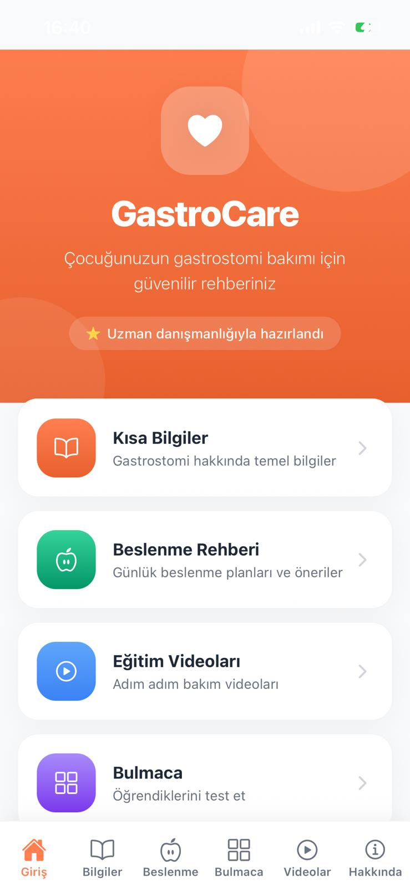
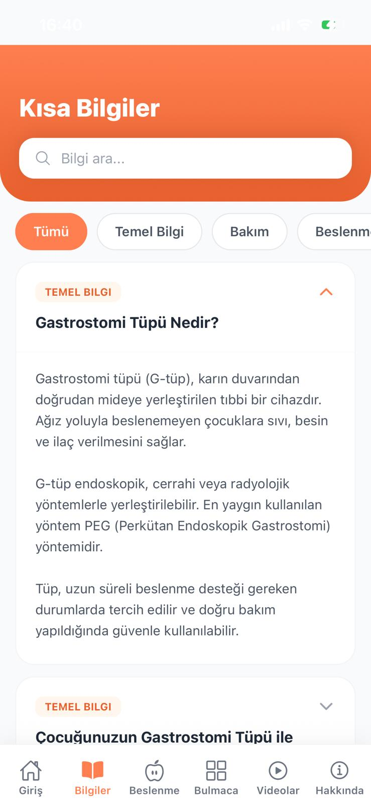
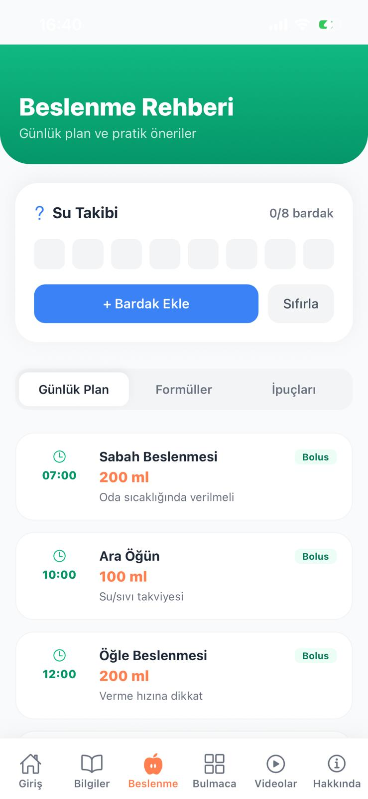
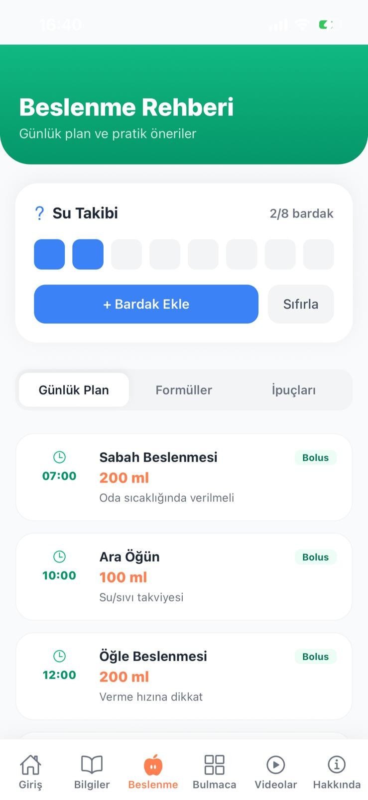
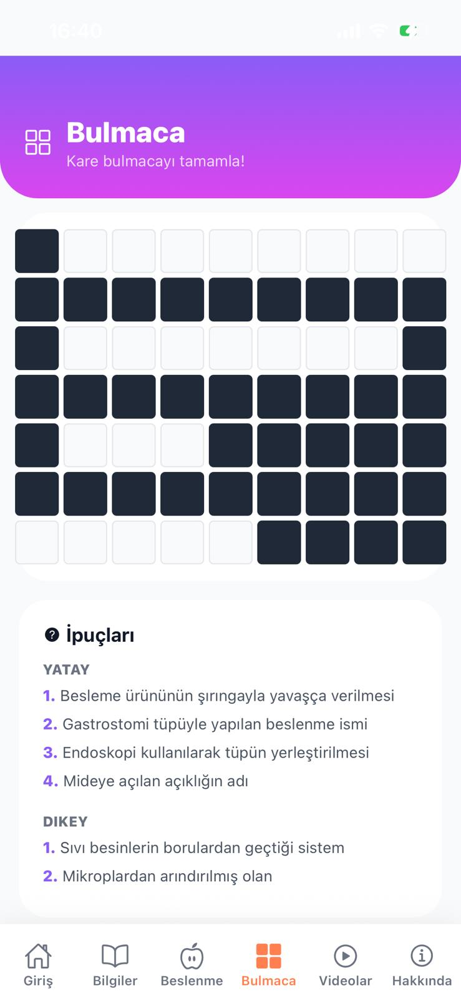
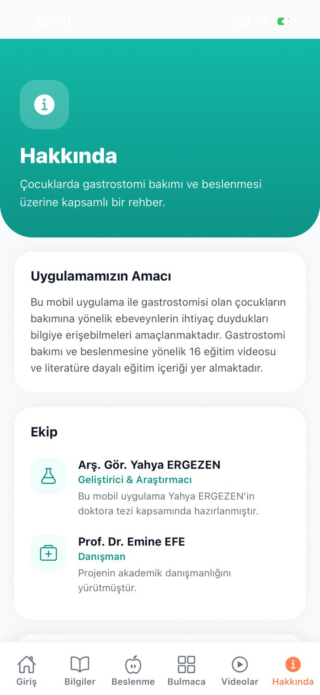

## GastroCare

GastroCare, gastrostomisi olan çocukların bakımından sorumlu ebeveynler için hazırlanmış eğitim amaçlı bir web ve mobil uygulamadır.  
Uygulama; kısa bilgiler, beslenme rehberi, eğitim videoları, bulmaca/quiz ve uygulama hakkında bilgilendirici ekranlardan oluşur.

---

## İlham Alınan Pano ve Tasarım

Bu proje, mavi tonların hâkim olduğu, alt tarafta sekmeli menü (icon + label) barındıran bir mobil tasarım panosundan ilham alınarak geliştirilmiştir.  
Aşağıdaki noktalara özellikle dikkat edildi:

- Kısa Bilgiler, Bulmaca ve Hakkında ekranlarının mavi degrade arka planı ve kart yapısı korunarak yeniden tasarlandı.
- Alt navigasyon çubuğu (Ana sayfa, Bilgiler, Beslenme, Bulmaca, Profil/Hakkında) mobil tarafta birebir tab bar olarak uygulandı.
- Yazı hiyerarşisi (büyük başlık, açıklama metinleri, vurgu renkleri) ilham panosundaki hissiyatı yansıtacak şekilde uyarlandı.

> Bu proje, Arş. Gör. Yahya ERGEZEN’in doktora tezi kapsamında, Prof. Dr. Emine EFE danışmanlığında geliştirilen GastroCare eğitim içeriklerini temel alır.

---

## Hedef Kullanıcı Kitlesi

- Gastrostomi tüpü olan çocukların ebeveynleri / birincil bakım verenleri
- Çocuk hemşireliği ve çocuk cerrahisi alanında çalışan sağlık profesyonelleri için destekleyici eğitim materyali
- Hemşirelik öğrencileri ve ilgili sağlık bilimleri öğrencileri

---

## Çözmeye Çalıştığı Problem

- Ebeveynler gastrostomi bakımı ve beslenmesi konusunda dağınık / zor erişilen bilgilere sahip.
- Kritik durumlarda (tüp tıkanması, tüp çıkması, enfeksiyon bulguları vb.) adım adım rehber ihtiyacı var.
- Eğitim sürecini desteklemek için etkileşimli içerik (quiz/bulmaca, videolar) eksik.

GastroCare, bu sorunları çözmek için:

- Kanıta dayalı, uzman onaylı içerikleri tek uygulamada toplar.
- Bilgiyi “Kısa Bilgiler”, “Beslenme”, “Videolar” ve “Bulmaca” sekmelerine bölerek anlaşılır hale getirir.
- Ebeveynlerin kendi hızında öğrenebileceği, mobil uyumlu bir arayüz sunar.

---
---

## Panoya Kattığım Kendi Fikirlerim

- **İçerik uyarlaması**: İlham aldığım panodaki genel tasarımı korurken, metinleri tamamen kendi doktora çalışmamdan aldığım GastroCare eğitim içeriklerine göre yeniden yazdım (ebeveyn dili, Türkçe ifadeler, eğitim vurguları vb.).
- **Bulmaca / quiz yapısı**: Panodaki basit bulmaca fikrini, gastrostomi ile ilgili kavramları ölçen soru–cevap / puanlama sistemiyle zenginleştirdim; böylece uygulama sadece bilgi veren değil, öğrenmeyi pekiştiren bir yapıya dönüştü.
- **Kategorili bilgi mimarisi**: “Kısa Bilgiler” bölümünde içerikleri Temel Bilgi, Bakım, Beslenme, Komplikasyon gibi klinik olarak anlamlı kategorilere ayırdım ve arama filtresi ekledim.
- **Beslenme rehberi sekmeleri**: İlham panosunda tek sayfalık içerik varken, ben beslenme bilgisini “Günlük Plan / Formüller / İpuçları” sekmelerine bölerek ebeveynin ihtiyacına göre hızlı erişim sağlayan bir yapı tasarladım.
- **Çoklu platform yaklaşımı**: Sadece mobil tasarım yapmak yerine, önce web tabanlı bir uygulama geliştirip daha sonra bununla uyumlu bir Expo/React Native sürümü tasarladım; böylece aynı içerik hem web’de hem mobilde kullanılabilir hale geldi.
- **Akademik bağlamın entegrasyonu**: Hakkında ekranına tez çalışmasının amacı, ekip ve destekleyen kurumları ekleyerek uygulamayı sıradan bir sağlık uygulamasından çıkarıp akademik bir projeye dönüştürdüm.

## Özellikler

- **Kısa Bilgiler**:  
  - Gastrostomi tüpü nedir, neden gereklidir, günlük bakım nasıl yapılır, komplikasyonlar vb. konularda kartlar.
  - Kategori filtresi ve arama alanı (Temel Bilgi, Bakım, Beslenme, Komplikasyon).

- **Beslenme Rehberi**:  
  - Günlük beslenme planı, formüller, pratik ipuçları.
  - Farklı sekmeler aracılığıyla bilginin düzenli sunumu.

- **Videolar**:  
  - Eğitim videolarının listesi (başlık, süre, kategori).  
  - İleride gerçek YouTube/yerel video oynatıcı ile entegre edilebilecek taslak yapı.

- **Bulmaca / Quiz**:  
  - Öğrenilen kavramları pekiştiren mini sorular.  
  - Puanlama ile ebeveynin kendi bilgisini değerlendirmesine imkân verir.

- **Hakkında**:  
  - Projenin amacı, ekip bilgisi (Arş. Gör. Yahya ERGEZEN, Prof. Dr. Emine EFE).  
  - Destekleyen kurumlar (SANERC, Vehbi Koç Vakfı Hemşirelik Fonu vb.).  
  - Akademik bağlam ve teşekkür metni.

- **Çoklu Platform**:  
  - Web uygulaması (Vite + React).  
  - Mobil uygulama (Expo Go üzerinden çalışan React Native sürümü).  
  - Android için APK olarak build alınmış sürüm.

---

## Kullanılan Teknolojiler

**Web (GastroCare/):**

- React 18
- Vite
- React Router
- Tailwind CSS (tema + utility class’lar)
- Shadcn / Radix tabanlı bileşen yapısı (tema değişkenleri, tasarım dili)
- Base44 entegrasyonu (web editörü / otomatik sayfa üretim altyapısı)

**Mobil (GastroCareExpo/):**

- Expo SDK 54 (Expo Go 54 ile uyumlu)
- React Native 0.81.x
- React Navigation (Bottom Tabs + Stack)
- Expo Vector Icons (`@expo/vector-icons`)
- `expo-linear-gradient` (degrade başlık alanları)
- Metro bundler üzerinden canlı yenileme

---

## Kurulum ve Çalıştırma

### 1. Web Uygulaması (GastroCare)

#### Gereksinimler

- Node.js 18+ (veya 20+)
- npm

#### Adımlar

# Proje klasörüne geç
cd "C:\Users\Acer\OneDrive\Desktop\mobil uyg\GastroCare"

# Bağımlılıkları kur
npm install

# Geliştirme sunucusunu çalıştır
npm run dev

Terminalde gözüken adresten (genelde `http://localhost:5173`) uygulamayı tarayıcıda açabilirsin.

---

### 2. Mobil Uygulama (GastroCareExpo – Expo)

**Gereksinimler**

- Node.js 18+  
- npm  
- Telefonda **Expo Go 54.x**

**Adımlar**

cd "C:\Users\Acer\OneDrive\Desktop\mobil uyg\GastroCareExpo"

# Bağımlılıkları kur (ilk sefer)
npm install

# Expo geliştirme sunucusunu başlat
npx expo start

## Uygulama Çıktısı (Ekran Görüntüleri)

### Demo Videosu

[Uygulama Tanıtım Videosu (YouTube)-EXPO GO](https://youtube.com/shorts/Ttc63c5Rofg?si=H8Na8eDntLh9KTzr)

### APk 
   ## APK Dosyası

   Derlenmiş Android sürümü (APK) bu projede yer almaktadır:

   - [GastroCare.apk](./release/GastroCare.apk)